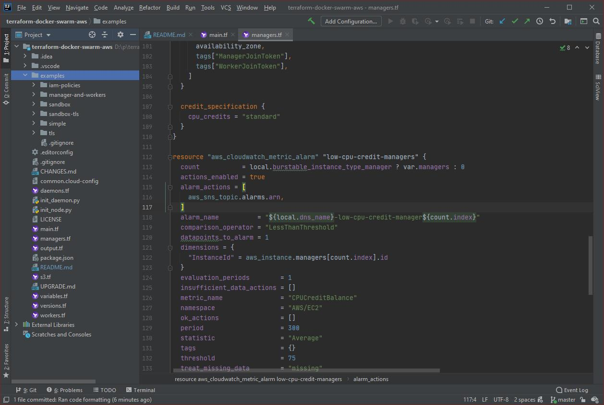

# AWS Docker Swarm Terraform Module

This is a Terraform configuration that sets up a Docker Swarm on an existing VPC with a configurable amount of managers and worker nodes. The swarm is configured to have [SSH daemon access][ssh-daemon] enabled by default with [EC2 instance monitoring](https://docs.aws.amazon.com/AWSEC2/latest/UserGuide/mon-scripts.html).

## Terraformed layout

In the VPC there will be 2 x _number of availability zones in region_ subnets created. Each EC2 instance will be placed in an subnet in a round-robin fashion.

There are no elastic IPs allocated in the module in order to prevent using up the elastic IP allocation for the VPC. It is up to the caller to set that up.

## Prerequisites

The `aws` provider is configured in your TF file.

AWS permissions to do the following:

- Manage EC2 resource
- Security Groups
- IAM permissions
- SNS
- Cloudwatch Alarms

The `examples/iam-policies` shows the policy JSONs that are used.

For earlier versions of the module, *S3 Create and Access* was required to store the tokens.  Tags are used in the current releases to save on S3 costs.  This method is not deprecated as of yet.

## Secure Docker daemon port

**DEPRECATION NOTICE** Docker TLS daemon support will be removed in a future releases.  Use [SSH to connect to the Docker Daemon][ssh-daemon].

The first few _manager_ nodes will expose port 2376. For TLS to work, the following are required

- elastic IP for remote connections. These will determine the number of servers that will have TLS enabled.
- public host names the docker port to add to the SANs.
- private key data for each server needs to be provided, this should match the amount of elastic IPs being created.
- signed certificate for each server needs to be provided. The CSR will be provided by the module.
- CA certificate.

When present a systemd drop-in file is added to `/etc/systemd/system/docker.service.d` to enable

    --tlsverify
    --tlscacert=ca.pem
    --tlscert=server-cert.pem
    --tlskey=server-key.pem
    -H 0.0.0.0:2376
    -H unix://

As noted in https://www.terraform.io/docs/providers/tls/r/private_key.html

> **Important Security Notice** The private key generated by this resource will be stored _unencrypted_ in your Terraform state file. **Use of this resource for production deployments is not recommended.** Instead, generate a private key file outside of Terraform and distribute it securely to the system where Terraform will be run.

As such the module does not create the private keys (though the example will show how to do it using Terraform). However, the CSRs are still created by the module and it is expected that Terraform will convert it to a CSR.

If you want to use elastic IPs but not expose the Docker socket you just leave the `daemon_count` as `0` (default).

## Limitations

- Maximum of 240 docker managers.
- Maximum of 240 docker workers.
- Only one VPC and therefore only one AWS region.
- The VPC must have to following properties
  - The VPC should have access to the Internet
  - The DNS hostnames support must be enabled (otherwise the node list won't work too well)
  - VPC must have a CIDR block mask of `/16`.

## Example

The `examples/simple` folder shows an example of how to use this module.

## Usage of S3

S3 was used because EFS and SimpleDB (both better choices in terms of cost and function) are NOT available in `ca-central-1` and likely some other non-US regions.

## Cloud Config merging

The default merge rules of cloud-config is used which may yield unexpected results (see [cloudconfig merge behaviours](https://jen20.com/2015/10/04/cloudconfig-merging.html)) if you are changing existing keys. To bring back the merge behaviour from 1.2 add

    merge_how: "list(append)+dict(recurse_array)+str()"

## Upgrading the swarm

Though `yum update` can simply update the software, it may be required to update things that are outside such as updates to the module itself, `cloud_config_extra` information or AMI updates.  For this to work, you need to have at least 3 managers otherwise you'd lose raft consensus and have to rebuild the swarm from scratch.

### Example of how to upgrade a 3 manager swawrm

Upgrading a 3 manager swarm needs to be done one at a time to prevent raft consensus loss.

1. Leave the swarm by executing `ssh <username>@<manager0> sudo /root/bin/leave-swarm.sh`
2. Taint `manager0` from the command line `terraform taint module.docker-swarm.aws_instance.managers[0]`
3. Rebuild `manager0` from the command line `terraform apply`
4. Wait until `manager0` rejoins the swarm by checking `docker node ls`
5. Leave the swarm by executing  `ssh <username>@<manager1> sudo /root/bin/leave-swarm.sh`
6. Taint `manager1` from the command line `terraform taint module.docker-swarm.aws_instance.managers[1]`
7. Rebuild `manager1` from the command line `terraform apply`
8. Wait until `manager1` rejoins the swarm by checking `docker node ls`
9. Leave the swarm by executing `ssh <username>@<manager2> sudo /root/bin/leave-swarm.sh`
10. Taint `manager2` from the command line `terraform taint module.docker-swarm.aws_instance.managers[2]`
11. Rebuild `manager2` from the command line `terraform apply`
12. Wait until `manager2` rejoins the swarm by checking `docker node ls`
13. Prune the nodes that are down and are drained `ssh <username>@<manager0> sudo /root/bin/prune-nodes.sh`

### Upgrading the worker nodes

A future relase of this would utilize auto-scaling for now this needs to be done manually

1. Drain and remove the worker node(s) from the swarm using `ssh <username>@<manager0> sudo /root/bin/rm-workers.sh <nodename[s]>`
2. Taint the workers that are removed from the command line `terraform taint module.docker-swarm.aws_instance.managers[#]`
3. Rebuild the workers from the command line `terraform apply`

## Other tips

* Support for exposing the Docker daemon and removal is expected on 5.0.  It is recommended to switch to [use SSH to access to the Docker daemon][ssh-daemon] as it forgoes managing certificates.
* Don't use Terraform to provision your containers, just let it build the infrastructure and add the hooks to connect it to your build system.
* The TLS example uses keys that are generated and stored in Terraform state.  This is risky as the keys are stored unencrypted.  That being said, there is no need to use the certificate request that is generated by the module, a set of presigned keys and certificates for the servers can be provided.
* To use a different version of Docker create a custom cloud config with 

    packages:
      - [docker, 18.03.1ce-2.amzn2]
      - haveged
      - python2-boto3
      - yum-cron
      - ec2-instance-connect
      - perl-Switch 
      - perl-DateTime
      - perl-Sys-Syslog
      - perl-LWP-Protocol-https
      - perl-Digest-SHA.x86_64

* If the private key or certificate is not locally available.  `create_daemon_certificate_request` should be set to `false`.
* Add additional SSH users using `sudo /root/bin/add-docker-user.sh <username> <ssh key string>`.  Note this creates users in such a way that it only allows the use of `docker context`
* In order to improve performance when using strong cryptography, [haveged] should be installed.
* `yum-cron` and `haveged` can be removed from the `packages` in the custom cloud config if desired.

## Thanks JetBrains

Thanks to [JetBrains License for Open Source Development](https://www.jetbrains.com/community/opensource/#support) for allowing use on this project.

[ssh-daemon]: https://github.com/docker/cli/pull/1014
[haveged]: http://issihosts.com/haveged/
[ec2-instance-connect]: https://docs.aws.amazon.com/AWSEC2/latest/UserGuide/Connect-using-EC2-Instance-Connect.html
